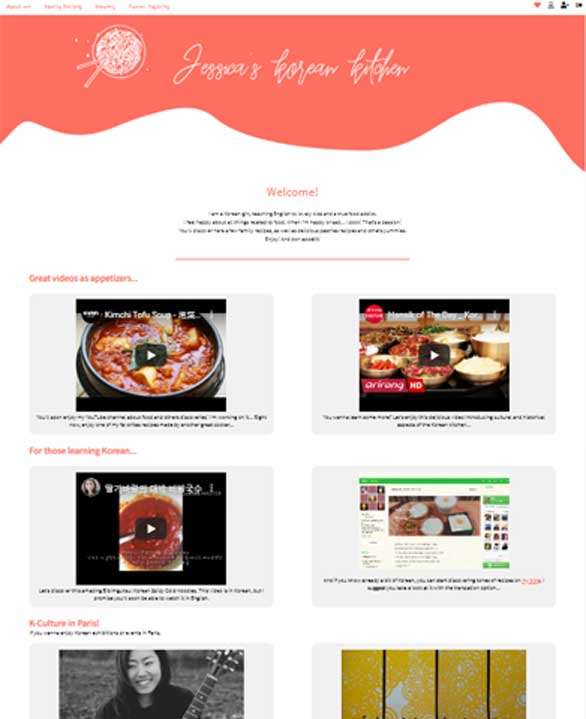
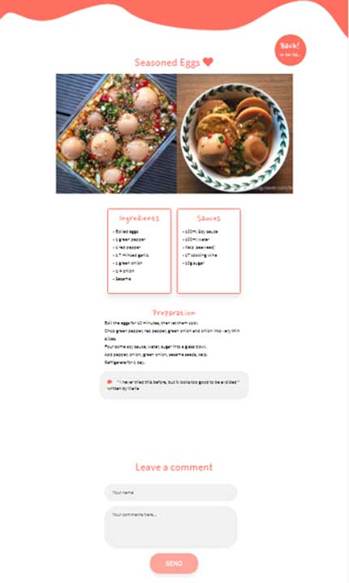

<h1># KOrean-Kitchen</h1>

<h2>Bienvenue sur Jessica's Korean Kitchen !</h2>

Ce projet a été réalisé pour valider la formation à la 3W Academy suivie durant l'hiver 2018. 
C'est l'aboutissement de 3 mois de code intensif, et mes tout premiers pas en tant qu'artisane du code.

Vous pouvez voir le projet en ligne à cette adresse : 
http://jessicas-ko-kitchen.com/index.php

<h2>Languages utilisés</h2>
Entièrement réalisé from scratch, il utilise les languages suivants :
<ul>
  <li>HTML</li>
  <li>CSS</li>
  <li>jQuery</li>
  <li>PHP, SQL</li>
 </ul>
 
<h2>Responsive</h2>
Il est responsive..., mais encore en cours d'amélioration :)

<h2>Screenshots</h2>

